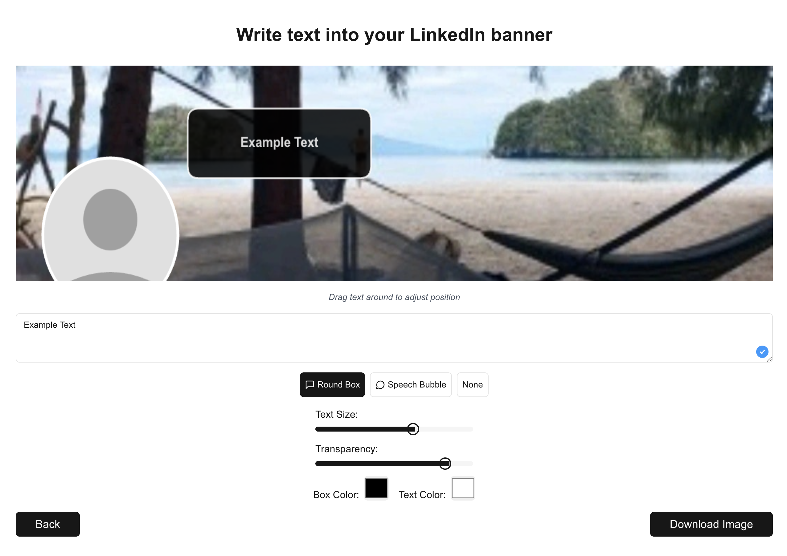

# LinkedIn Banner Text Editor

## Overview

This project is a web-based tool that allows users to easily add custom text to their LinkedIn banner images. Users can upload their LinkedIn banner photo, and the tool provides options to add text with various styles, colors, and positioning.


## Live Demo


You can try out the LinkedIn Banner Text Editor tool: 
- Go to your linkedin profile
- Right click your banner
- "Save image as..."
- Upload the image in the tool [https://text-in-banner.vercel.app/](https://text-in-banner.vercel.app/)
- Add text
- Download the banner


## Features

- Upload and display LinkedIn banner images directly in the browser
- Add customizable text to the banner
- Choose from different styles:
  - Round Box
  - Speech Bubble
  - Text Only (no box)
- Adjust text size and transparency
- Customize colors


## Technology Stack

- [Next.js](https://nextjs.org/) 
- [shadcn/ui](https://ui.shadcn.com/)
- [vercel](https://vercel.com/)


## Getting Started

1. Clone the repository:
   ```
   git clone https://github.com/your-username/linkedin-banner-text-editor.git
   ```

2. Install dependencies:
   ```
   cd linkedin-banner-text-editor
   npm install
   ```

3. Run the development server:
   ```
   npm run dev
   ```

4. Open [http://localhost:3000](http://localhost:3000) in your browser to see the application.


## Contributing

Contributions are welcome! Please feel free to submit a Pull Request.

## License

[MIT License](LICENSE)
